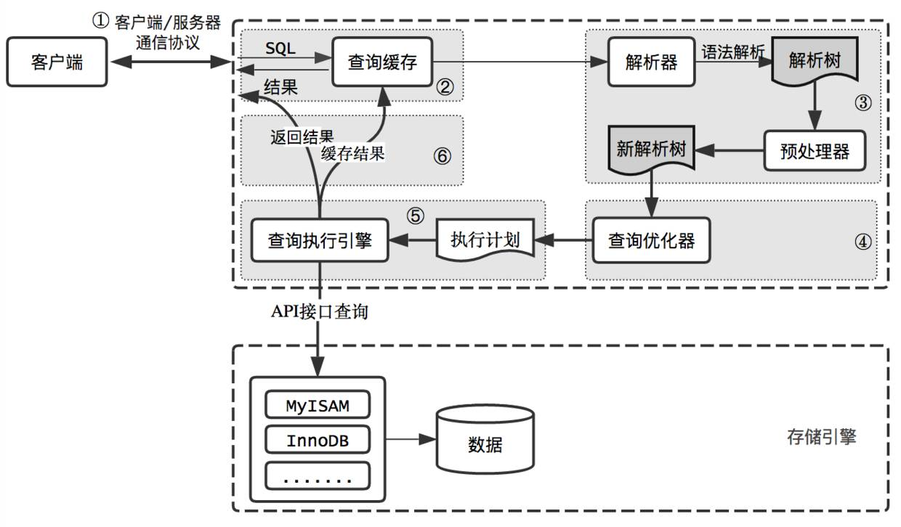

# Mysql 查询过程

## 连接

1. 客户端把语句发送给服务器端执行
   1. 在客户端发起一条语句查询，监听客户端的'连接管理磨块'接受请求
   2. 将请求转发到'连接进/线程模块'
   3.  调用‘用户  模块 ’进行授权检查
   4.  通过检查后，‘连接进/线程模块’从‘线程连接池’中取出空闲的被缓存的连接线程和客户端请求对接，如果失败则创建一个新的连接请求

## 处理

1. 查询高速缓存
   服务器会先在数据库的高速缓存中去查找，是否有相同语句的执行计划，如果查找到了，就直接执行这个 sql, 省去后续的工作。所以高速缓存能够提高 sql 的查询效率。一方面从内存中读取数据的效率较高；另一方面是省去了语句解析的原因。

   不过值得注意的一点是，这里的高速缓存和客户端软件的缓存是两码事，有的客户端为了提高查询效率也会设置缓存。 但是，其他人在服务器上  进行了相关的修改，导致修改的数据不能  及时反映到客户端上。可以看出  这两种缓存不是一码事。

2. 语句合法性检查
   服务器进程就会开始检查这条语句的合法性。这里主要是对 SQL 语句的语法进行检查。如果服务器进程认为这条 SQL 语句不符合语法规则的时候,就会把这个错误信息,反馈给客户端。在这个语法检查的过程中,不会对 SQL 语句中所包含的表名、列名等等进行 SQL 他只是语法上的检查。
3. 语言含义检查。
   若 SQL 语句符合语法上的定义的话,则服务器进程 接下去会对语句中的字段、表等内容进行检查。看看这些字段、表是否在数据库中。如果表名与列名不 准确的话,则数据库会就会反馈错误信息给客户端。
4. 获得对象解析锁
   当语法、语义都正确后,系统就会对我们需要查询的对象加锁。这主要是为了保障数据的一致性,防止我们在查询的过程中,其他用户对这个对象的结构发生改变。
5. 数据访问权限的核对
   当语法、语义通过检查之后,服务器进程还会检查,你所连接的用户是否有这个数据访问的权限。若你连接上服务器的用户不具有数据访问权限的话,则客户端就不能够取得这些数据。有时候我们查询数据的时候,辛辛苦 苦地把 SQL 语句写好、编译通过,但是,最后系统返回个 “没有权限访问数据”的错误信息,让我们气 半死。这在前端应用软件开发调试的过程中,可能会碰到。所以,要注意这个问题,数据库服务器进程先检查语法与语义,然后才会检查访问权限。
6. 确定最佳执行计划
   当语句与语法都没有问题,权限也匹配的话,服务器进程会根据一定的规则,对这条语句进行优化。不过要注意,这个优化是有限的。一般在应用软件开发的过程中,需要对数据库的 sql 语言进行优化,这个优化的作用要大大地大于服务器进程的自我优化。所以,一般在应用软件开发的时候,数据库的优化是少不了的。当服务器进程的优化器确定这条查询语句的最佳执行计划后,就会将这条 SQL 语句与执行计划保存到数据高速缓存。如此的话,等以后还有这个查询时,就会省略以上的语法、语义与权限检查的步骤,而直接执行 SQL 语句,提高 SQL 语句处理效率。

## 获取结果

1. query 请求完成后，将结果集返回给‘连接进/线程模块’
2. 返回的也可以是相应的状态标识，如成功或失败等
3. ‘连接进/线程模块’进行后续的清理工作，并继续等待请求或断开与客户端的连接
