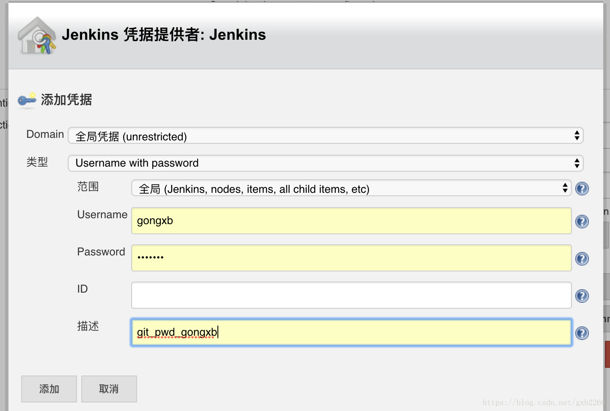

# JENKINS 配置

## 配置详情

1. 输入初始密码，初始密码在运行 jenkins 镜像之后会输出在控制台上，注意看下就可以了；

2. 插件安装，我选择的是安装推荐的插件；

3. 等待插件安装完成；

4. 创建用户，并没有什么好说的；

5. 进入 dashboard 页面，点击系统管理——全局工具管理，配置 JDK，GIT，Maven 等工具；

   - 关于 jdk 配置，可以直接填写本地的 jdk 路径，也可以登录 Oracle 的账号，让 jenkins 自己去下载；
   - 关于 git 配置，可以通过 which git 命令，查询本地的 git 的路径，然后配置到 jenkins 中；

   - 关于 maven 配置，我也是通过 jenkins 自动去安装的。

6. 安装插件，点击系统管理——管理插件，在安装完成之后，重启 Jenkins ，yourIp:yourPort/restar

   - 安装 maven_integration 插件；

   - 安装 gitlab 插件;

   - 安装 email_extention_templete 插件

7. 系统设置

   - **jenkins location：填写 url 和管理员的邮箱（这个地方需要注意）**；

   - git plugin: 填写 git 的用户名和 git 的邮箱；

   - extended email notification 的配置：

     - smtp server :smtp.qq.com
     - default user email suffer:@qq.com
     - 勾选 Use smtp authentication
     - 输入邮箱的地址，不需要带后缀@qq.com
     - password:这个地方并不是填写的邮箱的密码，而是在申请开通 pop/smtp 服务的时候，qq 邮箱给的一个**授权码**，特别注意；

   - **这个地方还有一个特别需要注意的地方，就是这里填写的邮箱，需要和上面的管理员邮箱是一致的，否则无法正常发送提醒邮件。还有一点，这里的邮箱是可以不用带后缀的**

   - 勾选使用 SSL 协议（否则可能会出现超时）；port:465
   - charset:UTF-8
   - 填写自定义的邮件模板，可以模板的类型设置为 HTML；

- gitlab 配置
  - connnection name :这个只要自己区分的开就可以了；
  - url: 填写 gitlab 的地址；
  - credentials:这个地方填写 gitlab 的用户信息，这里也可以通过 gitlab 的 sshkey：如下图：
    

## 参考

- [jenkins 配置](https://blog.csdn.net/gxb2260/article/details/80933331)
- [docker 运行 Jenkins](jenkins.md)
- [Jenkins 邮件模板](jenkins_mail.md)
