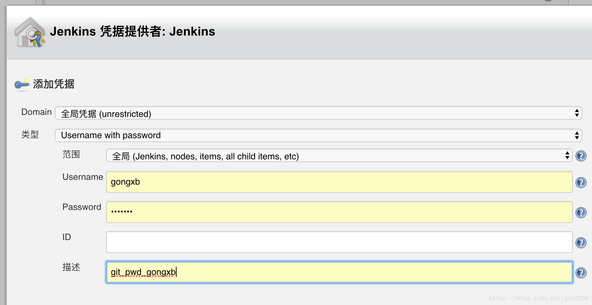
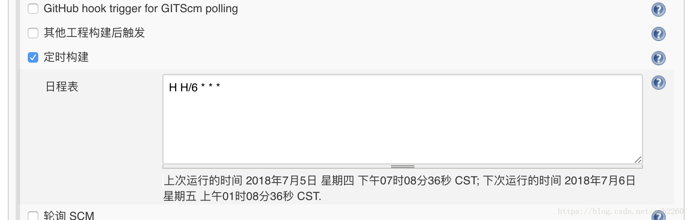
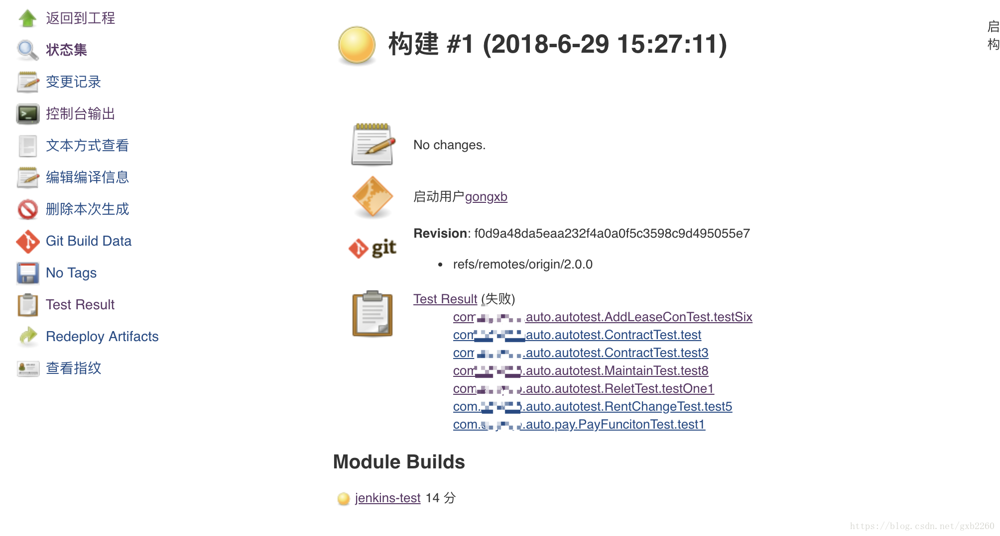

# Jenkins 执行自动化用例

1.  首先，你要有一个 maven 项目，并提交到 gitlab 上；

2.  在 dashboard 页面上，点击新建任务，选择构建一个 maven 项目。  如果没有这个选项，请安装 maven 插件。

3.  源码管理，选择 git，填写 git 项目的 URL,并新增用户和密码。新增用户的时候可以用用户名和密码，也可以通过用户名和配置在 gitlab 中的 sshkey，个人更倾向于使用用户名和密码。如下图：
    

4.  设置触发器，由于是自动化测试项目，所以我一般是设置代码定时执行。每天执行 4 次。
    

    1.表达式很简单粗暴 ： 分 时 日 月 周

    - H \* \* \* \* :表示每分钟执行一次
    - H H H  H/24 \*：表示一个月执行一次
    - H H/12 \*  \* \*：表示每 12 小时执行一次

5.  构建后操作：

    1.可以设置邮件提醒管理员和相关的开发人员，可以通过高级设置，设置邮件发送的条件，比如每次都发送，还是构建失败的时候发送；也可以设置每次发送邮件的收件人列表；也可以设置邮件的模板，具体的可以参考[这里](jenkins_mail.md)。

6.  设置完成之后，点击立即构建，然后就可以在控制台中看到日志输出， 但是看不出啥啊，日志刷新的太快了。

7、在执行完成之后，可以看到执行的结果，并分析具体的原因。

## 参考

- [jenkins 自动化测试](https://blog.csdn.net/gxb2260/article/details/80934055)
- [配置通知邮件](jenkins_mail.md)
- [jenkins 配置](jenkins_setup.md)
- [docker 安装 jenkins](jenkins.md)
