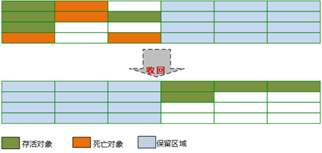

# 复制清除算法

该算法主要是为了解决标记-清除算法的效率问题；

## 算法思路

- 把内存划分为大小相等的两块，每次只使用其中一块；

- 当一块内存用完了，就将还存活的对象复制到另一块上（而后使用这一块）；

- 再把已使用过的那块内存空间一次清理掉，然后重复上面的  步骤；

执行过程如下图：

##  算法思路

- 这使得每次都是只对整个半区进行内存回收；
  内存分配时也不用考虑内存碎片等问题（可使用"指针碰撞"的方式分配内存）；

- 实现简单，运行高效；

## 算法缺点

- 空间浪费
  可用内存缩减为原来的一半，太过浪费。 这个点其实可以解决，不按 1:1 比例划分内存空间；

- 效率随对象存活率升高而变低
  当对象存活率较高时，需要进行较多复制操作，效率将会变低（解决：后面的标记-整理算法）；

## 应用场景

如 Serial 收集器、ParNew 收集器、Parallel Scavenge 收集器、、G1（从局部看）

---
