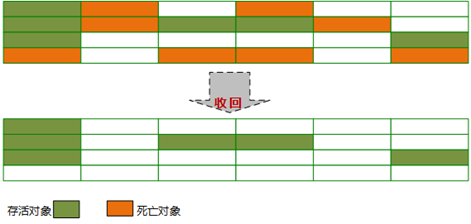

# 标记-清除算法

标记-清除（Mark-Sweep）算法是一种基础的收集算法。主要可以分为标记和清除  两个  步骤。

## 算法思路

1. 标记

- 首先标记出所有需要回收的对象；
  标记过程如《Java 虚拟机垃圾回收(一) 基础》"2-4、判断对象生存还是死亡"中所述--分为两个标记过程：

  1.第一次标记

  在可达性分析后发现对象到 GC Roots 没有任何引用链相连时，被第一次标记；并且进行一次筛选：此对象是否必要执行 finalize()方法；对有必要执行 finalize()方法的对象，被放入 F-Queue 队列中；

  2. 第二次标记

  GC 将对 F-Queue 队列中的对象进行第二次小规模标记；在其 finalize()方法中重新与引用链上任何一个对象建立关联，第二次标记时会将其移出"即将回收"的集合；

对第一次被标记，且第二次还被标记（如果需要，但没有移出"即将回收"的集合），就可以认为对象已死，可以进行回收。

2. 清除

   两次标记后，还在"即将回收"集合的对象将被统一回收；

   

## 算法优点

- 基于最基础的可达性分析算法，它是最基础的收集算法；

- 而后续的收集算法都是基于这种思路并对其不足进行改进得到的；

## 算法缺点

- 效率问题
  标记和清除两个过程的效率都不高；

- 空间问题
  标记清除后会产生大量不连续的内存碎片；这会导致分配大内存对象时，无法找到足够的连续内存；从而需要提前触发另一次垃圾收集动作；

##  应用场景

针对老年代的 CMS 收集器；
