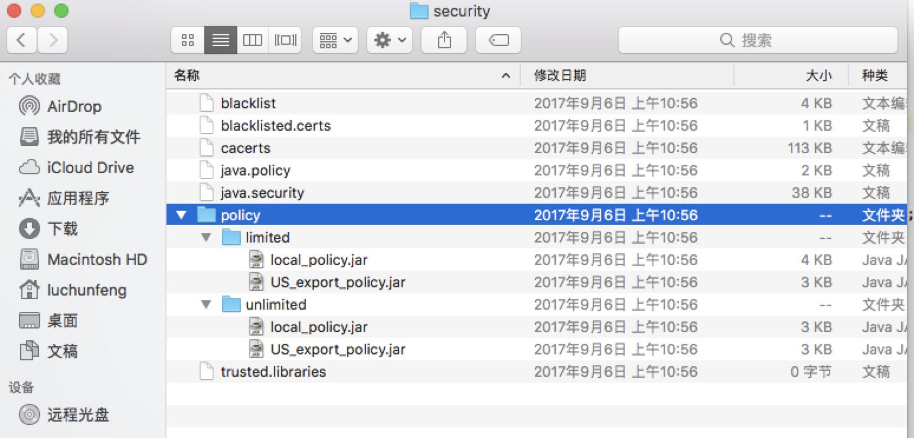

# 配置中心对称加密

## 1.JCE 加密

JCE（Java Cryptography Extension）是一组包，它们提供用于加密、密钥生成和协商以及 Message Authentication Code（MAC）算法的框架和实现。
它提供对对称、不对称、块和流密码的加密支持，它还支持安全流和密封的对象。它不对外出口，用它开发完成封装后将无法调用。

## 2. JCE 配置过程

1.  根据自己的 JDK 版本去下载相对应的压缩包，我用的 jdk 1.8 ，[点我下载].(https://www.oracle.com/technetwork/java/javase/downloads/jce8-download-2133166.html)。
2. 下载下来的 zip 包解压，得到 local_policy.jar 和 US_export_policy.jar。
3. 先备份 javahome 路径下 jre/lib/security 的 local_policy.jar 和 US_export_policy.jar,然后把下载的两个文件复制到该路径下。
4. spring cloud 配置中心的服务，查看加密的状态：
   localhost:10000/encrypt/status
   这个时候系统返回的  报错信息是：
   ```json
   {
     "description": "No key was installed for encryption service",
     "status": "NO_KEY"
   }
   ```
5. 在 yml 中配置上秘钥：

   ```YML
   encrypt:
       key: 123
   ```

   重启服务，然后重新验证，返回结果：

   ```json
   {
     "status": "OK"
   }
   ```

6. 加密
   curl -X POST http:/localhost:10000/encrypt -d mysqladmin

   返回的加密信息：8354721c6ae911dbb71866e88612bef9beab3a035d41b703fe9ecc4014237f8f

7. 解密
   curl -X POST http:/localhost:10000/decrypt -d 8354721c6ae911dbb71866e88612bef9beab3a035d41b703fe9ecc4014237f8f

   返回解密信息：mysqladmin

8. 在配置文件中使用加密信息：
   ```yml
   spring:
        durid:
            password:
   '{cipher}8354721c6ae911dbb71866e88612bef9beab3a035d41b703fe9ecc4014237f8f'
   ```

## 遇到的问题

- Mac OS 要怎么配置 JCE？

  mac 的 javaHome/jre/lib/security 下面并没有 local_policy.jar 和 US_export_policy.jar。 如下图所示
  
  

  把下载的两个 jar 包直接替换到 unlimited 中的两个 jar 包。但是之前试了好久一直都没有效果， 然后又突然好了……不懂不懂

- 加密到靠不靠谱？

   在配置加密之后， 重新启动服务， 服务是可以完成正常的 CRUD 的，这也  意味着我们的加密是完全可用的。但是如果我直接读取数据的密码呢？

  ```java
  @RestController
  @RefreshScope
  @Slf4j
  public class TestController {
    @Autowired UserService userService;

    @Value("${spring.durid.password}")
    private String hello;

    @GetMapping("/hello")
    public String from() {
      return this.hello;
    }

    @PostMapping("/add/user")
    public User addUser(@RequestBody User user) {
      log.info("user={}", user);
      return userService.insert(user);
    }
  }
  ```

  访问 hello 方法，返回的数据库密码是解密的。。。突然又迷失了方向，我是在干什么？ 不管我用什么秘钥， 用什么密码，都可以被服务端一部获取到服务密码。算了， 希望他们不要去  直接获取数据库密码:(
