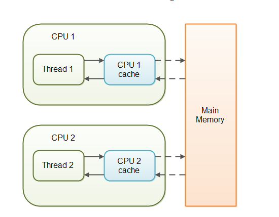

# Volatile

## 基本概念

### 可见性：

可见性是一种复杂的属性，因为可见性中的错误总是会违背我们的直觉。通常，我们无法确保执行读操作的线程能适时地看到其他线程写入的值，有时甚至是根本不可能的事情。为了确保多个线程之间对内存写入操作的可见性，必须使用同步机制。

可见性，是指线程之间的可见性，一个线程修改的状态对另一个线程是可见的。也就是一个线程修改的结果。另一个线程马上就能看到。比如：用 volatile 修饰的变量，就会具有可见性。volatile 修饰的变量不允许线程内部缓存和重排序，即直接修改内存。所以对其他线程是可见的。但是这里需要注意一个问题，volatile 只能让被他修饰内容具有可见性，但不能保证它具有原子性。比如 volatile int a = 0；之后有一个操作 a++；这个变量 a 具有可见性，但是 a++ 依然是一个非原子操作，也就是这个操作同样存在线程安全问题。

在 Java 中 volatile、synchronized 和 final 实现可见性。

### 原子性：

原子是世界上的最小单位，具有不可分割性。比如 a=0；（a 非 long 和 double 类型） 这个操作是不可分割的，那么我们说这个操作时原子操作。再比如：a++； 这个操作实际是 a = a + 1；是可分割的，所以他不是一个原子操作。非原子操作都会存在线程安全问题，需要我们使用同步技术（sychronized）来让它变成一个原子操作。一个操作是原子操作，那么我们称它具有原子性。java 的 concurrent 包下提供了一些原子类，我们可以通过阅读 API 来了解这些原子类的用法。比如：AtomicInteger、AtomicLong、AtomicReference 等。

在 Java 中 synchronized 和在 lock、unlock 中操作保证原子性。

### 有序性：

在 Java 内存模型中，允许编译器和处理器对指令进行重排序，但是重排序过程不会影响到单线程程序的执行，却会影响到多线程并发执行的正确性。Java 提供了 volatile 和 synchronized 两个关键字来保证线程之间操作的有序性，volatile 是因为其本身包含“禁止指令重排序”的语义，synchronized 是由“一个变量在同一个时刻只允许一条线程对其进行 lock 操作”这条规则获得的，此规则决定了持有同一个对象锁的两个同步块只能串行执行。
下面就来具体介绍下 happens-before 原则（先行发生原则）：

- 程序次序规则：一个线程内，按照代码顺序，书写在前面的操作先行发生于书写在后面的操作
- 锁定规则：一个 unLock 操作先行发生于后面对同一个锁额 lock 操作
- volatile 变量规则：对一个变量的写操作先行发生于后面对这个变量的读操作
- 传递规则：如果操作 A 先行发生于操作 B，而操作 B 又先行发生于操作 C，则可以得出操作 A 先行发生于操作 C
- 线程启动规则：Thread 对象的 start()方法先行发生于此线程的每个一个动作
- 线程中断规则：对线程 interrupt()方法的调用先行发生于被中断线程的代码检测到中断事件的发生
- 线程终结规则：线程中所有的操作都先行发生于线程的终止检测，我们可以通过 Thread.join()方法结束、Thread.isAlive()的返回值手段检测到线程已经终止执行
- 对象终结规则：一个对象的初始化完成先行发生于他的 finalize()方法的开始

这 8 条原则摘自《深入理解 Java 虚拟机》。前 4 条规则是比较重要的，后 4 条规则都是显而易见的。

## Volatile 原理

Java 语言提供了一种稍弱的同步机制，即 volatile 变量，用来确保将变量的更新操作通知到其他线程。当把变量声明为 volatile 类型后，编译器与运行时都会注意到这个变量是共享的，因此不会将该变量上的操作与其他内存操作一起重排序。volatile 变量不会被缓存在寄存器或者对其他处理器不可见的地方，因此在读取 volatile 类型的变量时总会返回最新写入的值。

当一个变量定义为 volatile 之后，将具备两种特性：

1. 保证此变量对所有的线程的可见性，这里的“可见性”，如本文开头所述，当一个线程修改了这个变量的值，volatile 保证了新值能立即同步到主内存，以及每次使用前立即从主内存刷新。但普通变量做不到这点，普通变量的值在线程间传递均需要通过主内存（详见：Java 内存模型）来完成。

2. 禁止指令重排序优化。有 volatile 修饰的变量，赋值后多执行了一个“load addl \$0x0, (%esp)”操作，这个操作相当于一个内存屏障（指令重排序时不能把后面的指令重排序到内存屏障之前的位置），只有一个 CPU 访问内存时，并不需要内存屏障；（什么是指令重排序：是指 CPU 采用了允许将多条指令不按程序规定的顺序分开发送给各相应电路单元处理）。

### volatile 性能：

volatile 的读性能消耗与普通变量几乎相同，但是写操作稍慢，因为它需要在本地代码中插入许多内存屏障指令来保证处理器不发生乱序执行。

### volatile 使用场景

使用 volatile 必须具备以下 2 个条件：

- 对变量的写操作不依赖于当前值
- 该变量没有包含在具有其他变量的不变式中

实际上，这些条件表明，可以被写入 volatile 变量的这些有效值独立于任何程序的状态，包括变量的当前状态。我的理解就是上面的 2 个条件需要保证操作是原子性操作，才能保证使用 volatile 关键字的程序在并发时能够正确执行。

## 参考

- [海子的博客](https://www.cnblogs.com/dolphin0520/p/3920373.html)
