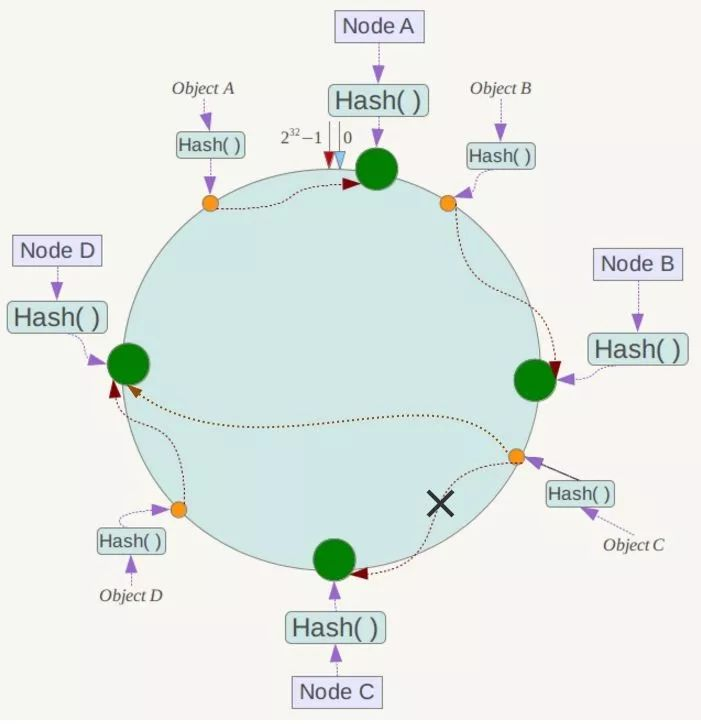
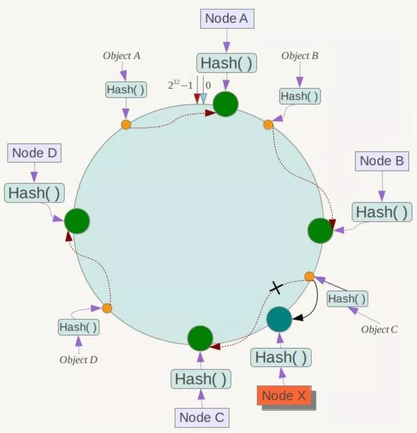
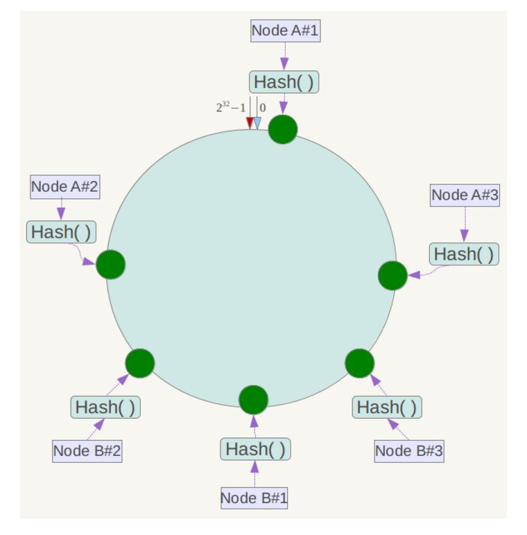

# 一次性 Hash 算法

## Hash 算法

之前在面试的时候，总是被人问到 HashMap 的底层实现。 后来  就对 Hash 算法有了一定的了解，用我们最贴近生活的例子军训的时候。 一般都会要求我们从高到矮依次站好，然后报数，报到 1 的站一队，报到 2 的站一对， 队伍中的  每个人只需要记住自己左边/右边的  人就好了……我  觉得这个就是 HashMap 的  实现原理是一样的：先按照某一个条件计算出一个值，然后进行散列，然后散列值相同的数据，存在链表里，这样就有了拉链结构（数组+链表）。
突然想明白了好多  刚刚学习的时候问题，比如数据库分表，或者数据库 Hash 索引，redis 集群等。但是这个也可能存在问题。

##  遇到的问题

 还是参考网上用的最多的 redis 集群服务来说，我们对 key 的 hash 值进行  求模，如果为 1，放置在第一台服务器上，为 2 ，放置在第二太服务器上……那么这个时候就有一个最大的问题，如果我现在新增了一台服务器怎么办？是不是要重新计算所有的值的 Hash 与服务器数量的模……

## 一次性 Hash

### 基本原理

一致性 Hash 算法是对 2^32 取模的方法，而不是之前我们根据服务器的数量。一致性 Hash 算法将整个哈希值空间组织成一个虚拟的圆环，如假设某哈希函数 H 的值空间为 0-2^32-1（即哈希值是一个 32 位无符号整形）。整个空间按顺时针方向组织，圆环的正上方的点代表 0，0 点右侧的第一个点代表 1，以此类推，2、3、4、5、6……直到 2^32-1，也就是说 0 点左侧的第一个点代表 2^32-1， 0 和 2^32-1 在零点中方向重合，我们把这个由 2^32 个点组成的圆环称为 Hash 环。

下一步将各个服务器使用 Hash 进行一个哈希，具体可以选择服务器的 IP 或主机名作为关键字进行哈希，这样每台机器就能确定其在哈希环上的位置，这里假设将上文中四台服务器使用 IP 地址哈希后在环空间的位置如下：

放置对象，我们根据对象的某个一属性，把所有的值散列到这个  虚拟圆环上，并且默认  圆环上的点  顺时针遇到的第一个点就是他要存储的服务器。如图，ObjeceA 存储在节点 A，ObjectC 存储在节点 C。

### 容错性

现假设 Node C 不幸宕机，可以看到此时对象 A、B、D 不会受到影响，只有 C 对象被重定位到 Node D。一般的，在一致性 Hash 算法中，如果一台服务器不可用，则受影响的数据仅仅是此服务器到其环空间中前一台服务器（即沿着逆时针方向行走遇到的第一台服务器）之间数据，其它不会受到影响，如下所示：

### 扩展性

如果我们要新增服务器，那么其实  影响也不是很大，比如我们新增一个节点 nodeX 。此时对象 Object A、B、D 不受影响，只有对象 C 需要重定位到新的 Node X ！一般的，在一致性 Hash 算法中，如果增加一台服务器，则受影响的数据仅仅是新服务器到其环空间中前一台服务器（即沿着逆时针方向行走遇到的第一台服务器）之间数据，其它数据也不会受到影响。

### 虚拟节点

一致性哈希算法在服务节点太少时，容易因为节点分部不均匀而造成数据倾斜问题。例如我们的系统中有两台服务器，其环分布如下：

此时必然造成大量数据集中到 A 节点上，而只有极少量会定位到 B 节点 上。为了解决这种数据倾斜问题，一致性哈希算法引入了虚拟节点机制，即对**每一个服务节点计算多个哈希，每个计算结果位置都放置一个此服务节点，称为虚拟节点**。具体做法可以在服务器 ip 或主机名的后面增加编号来实现。例如上面的情况，我们决定为每台服务器计算三个虚拟节点，于是可以分别计算“Memcached Server A#1”、“Memcached Server A#2”、“Memcached Server A#3”、“Memcached Server B#1”、“Memcached Server B#2”、“Memcached Server B#3”的哈希值，于是形成六个虚拟节点：

同时数据定位算法不变，只是多了一步虚拟节点到实际节点的映射，例如定位到“Node A#1”、“Node A#2”、“Node A#3”三个虚拟节点的数据均定位到 Node A 上。这样就解决了服务节点少时数据倾斜的问题。在实际应用中，通常将虚拟节点数设置为 32 甚至更大，因此即使很少的服务节点也能做到相对均匀的数据分布。

## 参考

- [java 后端技术的 CSDN](https://blog.csdn.net/bntX2jSQfEHy7/article/details/79549368)
- [cnblogs](https://www.cnblogs.com/moonandstar08/p/5405991.html)
